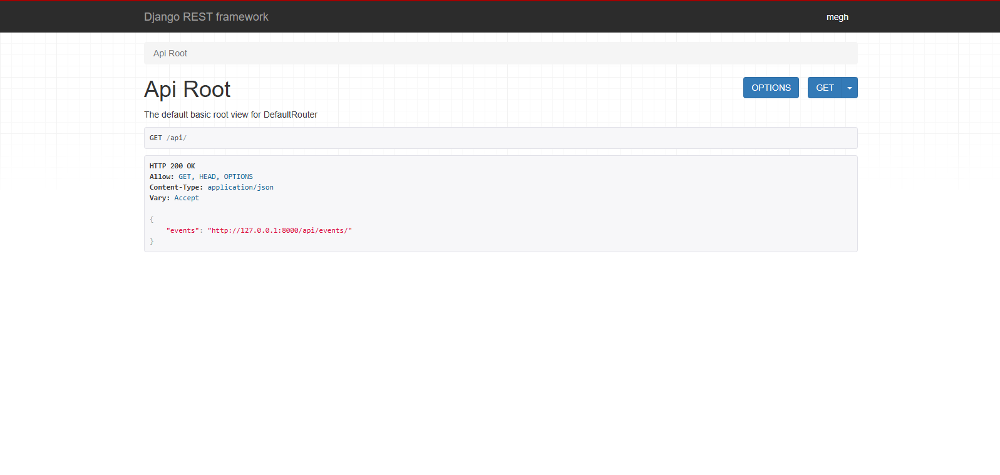
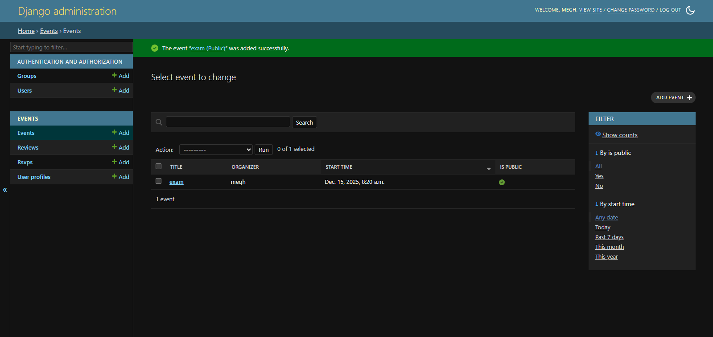
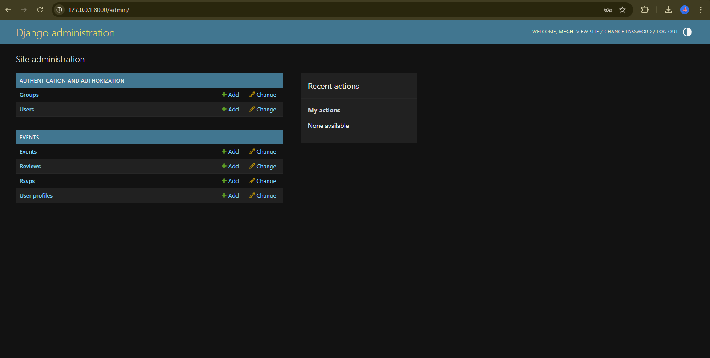
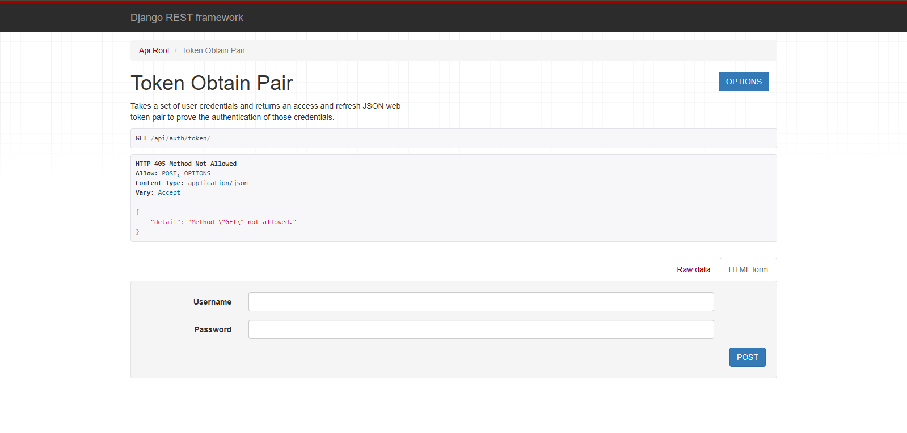

# Event Management System (Django + DRF)

Event Management API with JWT auth, organizer permissions, RSVPs, and reviews.

## Features
- JWT auth (SimpleJWT)
- Event CRUD (organizer-only edits/deletes; private events limited to invitees)
- RSVPs (Going/Maybe/Not Going)
- Reviews with rating validation
- Pagination, search, filtering
- Optional Celery task stub for async emails

## Setup
```bash
python -m venv .venv
.venv\Scripts\activate
pip install -r requirements.txt
python manage.py migrate
python manage.py runserver
```

## Auth (JWT)
1) Create user (`python manage.py createsuperuser` or via admin).
2) POST `/api/auth/token/` with `{"username": "...", "password": "..."}`.
3) Use `Authorization: Bearer <access>` for protected endpoints.

## Key Endpoints
- Events: `GET/POST /api/events/`, `GET/PUT/PATCH/DELETE /api/events/{id}/`
- RSVP: `POST /api/events/{event_id}/rsvp/`, `PATCH /api/events/{event_id}/rsvp/{rsvp_id}/`
- Reviews: `GET/POST /api/events/{event_id}/reviews/`
- Admin: `/admin/`

Search/filter example: `/api/events/?search=music&location=NYC&ordering=start_time`

## Optional: Celery
Requires Redis running locally.
```bash
celery -A core worker --loglevel=info
```
```python
from events.tasks import send_event_notification
send_event_notification.delay("Hello", "Body", "test@example.com")
```
## Tests
```bash
.venv\Scripts\activate
python manage.py test
```
## Screenshots





## Notes
- Email backend: console (development).
- Default DB: SQLite (change in `core/settings.py` if needed).
